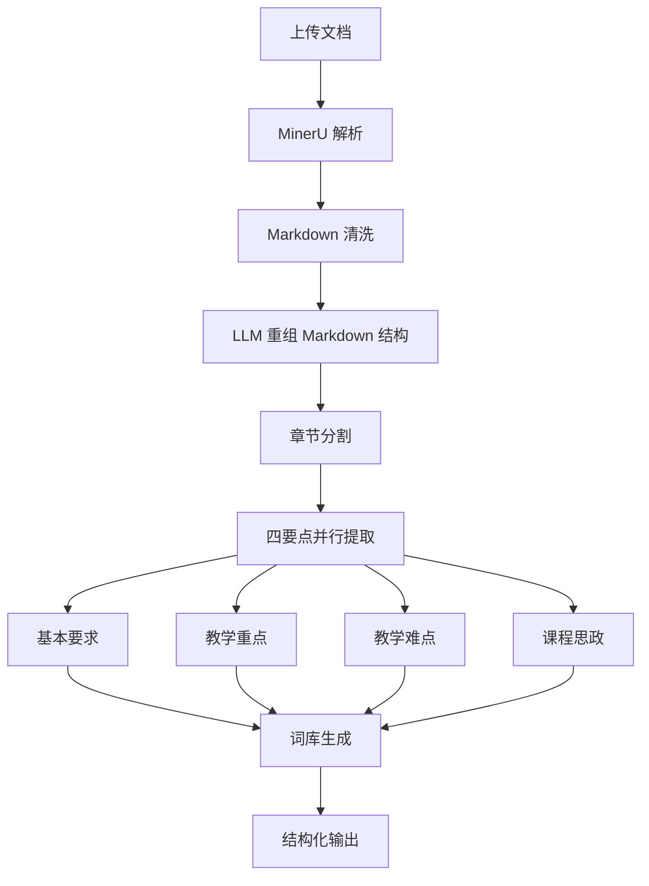
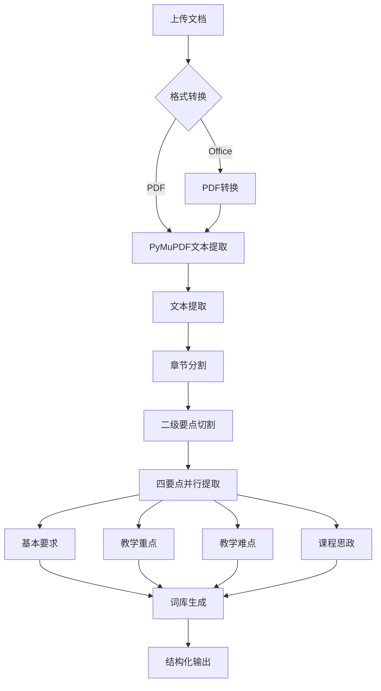

# 教学大纲四要点核心内容提取系统

## 项目概述

本项目是一个基于 FastAPI 构建的教学大纲智能处理系统，能够自动化分析教学大纲文档，提取**基本要求、教学重点、教学难点、课程思政**四个关键模块的核心内容，并生成结构化的知识点词库。

## 快速开始

### 最小化启动（3 步）

```bash
# 1. 安装依赖
pip install -r requirements.txt

# 2. 配置 config.toml（修改 LLM API 密钥、MinerU 服务地址）
vim config.toml

# 3. 启动服务
python -m app.main
```

访问 http://localhost:8000/docs 查看 API 文档

### 快速测试

```bash
# 测试文档处理（需要先启动服务）
python app/tests/test_client.py app/tests/data/海洋学院-SR113026-海洋油气地质学.pdf

# 或使用快速测试（无需启动服务）
python app/tests/test_quick.py
```

## 核心功能

### 文档处理能力
- **多格式文档解析**: 支持 PDF、Word、PPT 等多种文档格式的解析与文本提取
- **MinerU OCR 解析**: 通过 MinerU 服务进行高精度文档 OCR，支持扫描件和复杂排版
- **智能章节分割**: 基于文档结构自动识别并切割章节，支持多级标题

### 内容提取能力
- **四要点智能提取**: 利用大语言模型(LLM)精准提取四个核心模块的内容
  - 基本要求 (Basic Requirements)
  - 教学重点 (Key Points)
  - 教学难点 (Difficult Points)
  - 课程思政 (Ideological Education)
- **词库自动生成**: 为每个知识点生成专业词库（5+ 个相关术语），支持术语扩展
- **结构化输出**: 生成标准化的 JSON 格式结果，便于后续处理

### 系统特性
- **双模式文档解析**: 支持 MinerU（纯文本 LLM）和 VLM（视觉大模型）两种文档处理模式
- **异步任务处理**: 支持大规模文档的异步处理与状态追踪
- **并行处理**: 四要点提取采用并行处理，提升处理速度
- **错误重试**: LLM 调用支持指数退避重试机制
- **完整日志**: 详细的处理日志，便于调试和监控

## 系统架构

```
教学大纲四要点核心内容提取系统
├── app/                          # 主应用目录
│   ├── api/                      # API 路由层
│   │   └── v1/                     # API v1 版本
│   │       ├── endpoints/            # 接口端点
│   │       │   ├── document.py         # 文档处理接口
│   │       │   ├── lesson.py           # 课堂分析接口
│   │       │   ├── lexicon.py          # 词库管理接口
│   │       │   ├── quality_*.py        # 质量画像接口
│   │       │   ├── system.py           # 系统状态接口
│   │       │   └── task.py             # 任务管理接口
│   │       └── router.py             # 路由注册
│   ├── core/                     # 核心模块
│   │   ├── config.py               # 配置管理
│   │   ├── database.py             # 数据库连接
│   │   ├── exceptions.py           # 异常处理
│   │   └── logging_config.py       # 日志配置
│   ├── prompts/                  # 提示词模板
│   │   ├── chapter.py              # 章节提取提示词
│   │   ├── dagang.py               # 四要点提取提示词
│   │   ├── extractmd.py            # Markdown 提取提示词
│   │   ├── lesson.py               # 课堂分析提示词
│   │   ├── lexicon.py              # 词库生成提示词
│   │   └── mindmap.py              # 思维导图提示词
│   ├── schemas/                  # 数据模型
│   │   ├── request.py              # 请求模型
│   │   └── response.py             # 响应模型
│   ├── services/                 # 业务服务层
│   │   ├── pipeline.py             # 传统处理管道
│   │   ├── llm_pipeline.py         # LLM 提取管道（双模式）
│   │   ├── mineru_service.py       # MinerU 文档解析服务
│   │   ├── lesson_pipeline.py      # 课堂分析管道
│   │   ├── mindmap_generator.py    # 思维导图生成
│   │   ├── converters/             # 文档转换
│   │   │   └── office_to_pdf.py      # Office转PDF
│   │   ├── models/                 # 模型调用
│   │   │   └── call_llm.py           # LLM调用封装
│   │   ├── parsers/                # 文档解析
│   │   │   ├── chapter_splitter.py   # 章节分割
│   │   │   ├── document_parser.py    # 文档解析入口
│   │   │   └── subpoint_splitter.py  # 二级要点分割
│   │   ├── db/                     # 数据库服务
│   │   │   ├── task_service.py       # 任务管理
│   │   │   └── syllabus_service.py   # 大纲数据
│   │   └── summarizer/             # 内容摘要
│   │       ├── lexicon_generator.py  # 词库生成
│   │       └── summary_generator.py  # 摘要生成
│   ├── tests/                    # 测试目录
│   │   ├── test_client.py          # API 测试客户端
│   │   ├── test_quick.py           # 快速测试
│   │   └── 大纲-石油与天然气地质.pdf  # 测试数据
│   └── main.py                   # FastAPI 应用入口
├── config.toml                   # 主配置文件
├── requirements.txt              # 依赖列表
├── Dockerfile                    # Docker构建文件
├── .env.example                  # 环境变量示例
└── CLAUDE.md                     # Claude Code 项目指南
```

## 处理流程

### MinerU 模式（推荐）



### VLM 模式



## 安装部署

### 环境要求

- Python 3.10+ (推荐 3.12)
- 16GB+ 内存
- MinerU 服务（如需 MinerU 模式）
- Linux/macOS/Windows

### 安装步骤

1. **克隆项目**
```bash
git clone <repository-url>
cd 教学大纲四要点核心内容提取工程
```

2. **创建虚拟环境**
```bash
python -m venv venv
source venv/bin/activate  # Linux/Mac
# 或 venv\Scripts\activate  # Windows
```

3. **安装依赖**
```bash
pip install -r requirements.txt
```

4. **配置环境变量**
```bash
cp .env.example .env
# 编辑 .env 文件，配置 LLM API 密钥等信息
```

5. **配置主配置文件**
```bash
# 编辑 config.toml，配置 LLM 模型、MinerU 服务地址等
```

### Docker 部署

```bash
# 构建镜像
docker build -t syllabus-extraction .

# 运行容器
docker run -d -p 8000:8000 \
  -v $(pwd)/config.toml:/app/config.toml \
  -v $(pwd)/.env:/app/.env \
  -v $(pwd)/data:/app/data \
  syllabus-extraction
```

## 使用方法

### 启动服务

```bash
# 开发模式（自动重载）
uvicorn app.main:app --reload --port 8000

# 或直接运行
python -m app.main

# 生产模式（多进程）
uvicorn app.main:app --host 0.0.0.0 --port 8000 --workers 4
```

服务启动后，访问:
- API 文档: http://localhost:8000/docs
- ReDoc 文档: http://localhost:8000/redoc
- 健康检查: http://localhost:8000/health

### API 调用示例

**1. 提交文档处理任务**
```bash
curl -X POST "http://localhost:8000/api/v1/document/process" \
  -F "file=@教学大纲.pdf"

# 响应示例
{
  "task_id": "syllabus-xxxx",
  "status": "pending",
  "message": "任务已提交（MinerU模式），请使用 GET /api/v1/document/status/... 查询处理进度"
}
```

**2. 查询任务状态**
```bash
curl "http://localhost:8000/api/v1/document/status/{task_id}"
```

**3. 任务管理**
```bash
# 列出所有任务
curl "http://localhost:8000/api/v1/task/list"

# 删除任务
curl -X DELETE "http://localhost:8000/api/v1/task/{task_id}"
```

**4. 健康检查**
```bash
curl "http://localhost:8000/health"
```

### 使用测试客户端

```bash
# 测试文档处理
python app/tests/test_client.py app/tests/data/海洋学院-SR113026-海洋油气地质学.pdf

# 健康检查
python app/tests/test_client.py --health

# 查询任务状态
python app/tests/test_client.py --status <task_id>

# 快速测试（无需启动服务器）
python app/tests/test_quick.py

# 完整测试（需要启动服务器）
python app/tests/test_quick.py --full
```

## 配置说明

### config.toml

```toml
[project]
name = "教学大纲四要点核心内容提取系统"
version = "1.0.0"
debug = true

[llm]
# MinerU 模式下可使用纯文本 LLM
model = "Qwen/Qwen3-32B"
base_url = "https://api.siliconflow.cn/v1"
# VLM 模式下使用视觉大模型
# model = "doubao-seed-2-0-mini-260215"
# base_url = "https://ark.cn-beijing.volces.com/api/v3"
max_tokens = 8192
temperature = 0

[mineru]
# 启用 MinerU 文档解析（替代 VLM 文档解析）
enabled = true
# MinerU 服务地址
base_url = "http://10.80.5.25:8000"
# 文件解析接口路径
parse_endpoint = "/file_parse"
# 请求超时（秒）
timeout = 120

[chunking]
chunk_size = 10000
overlap = 1000
batch_size = 100

[logging]
level = "INFO"
format = "%(asctime)s - %(name)s - %(levelname)s - %(message)s"
file = ""
```

### .env 环境变量

```bash
# LLM API 密钥
LLM_API_KEY=your-api-key-here

# 日志配置
LOG_LEVEL=INFO
LOG_FILE=app.log

# 调试模式
DEBUG=false
```

## 输出格式

### 成功响应示例

```json
{
  "course": "石油与天然气地质学",
  "result": [
    {
      "chapter": "绪论",
      "num": 1,
      "content": [
        {
          "basic": [
            {
              "title": "理解课程体系与学科发展历程",
              "num": 1,
              "summary": "掌握课程体系及学科发展脉络",
              "lexicon": ["发展历程", "课程体系", "专业框架", "教育结构", "学科演变"]
            }
          ]
        },
        {
          "keypoints": [
            {
              "title": "石油工业发展历史",
              "num": 1,
              "summary": "梳理石油工业历史沿革脉络",
              "lexicon": ["产业沿革", "历史分析", "历史传承", "石油史", "工业发展"]
            }
          ]
        },
        {
          "difficulty": [
            {
              "title": "建立能源战略认知",
              "num": 1,
              "summary": "构建能源战略与学科关系认知",
              "lexicon": ["能源战略", "宏观认知", "全球视野", "战略思维", "行业定位"]
            }
          ]
        },
        {
          "politics": [
            {
              "title": "铁人精神传承",
              "num": 1,
              "summary": "理解铁人精神内涵与传承意义",
              "lexicon": ["铁人精神", "文化传承", "价值观念", "精神内涵", "传承教育"]
            }
          ]
        }
      ]
    }
  ],
  "usage": {
    "prompt_tokens": 7502,
    "completion_tokens": 11004,
    "total_tokens": 18506
  }
}
```

每个知识点的数据结构包含三个字段：
- **title**: 知识点的标题（≤18字）
- **summary**: 知识点的概述（≤50字）
- **lexicon**: 自动生成的专业词库列表（5+个相关术语）

## 开发指南

### 项目结构规范

- `app/api/` - API 路由和端点定义
- `app/core/` - 核心配置、异常处理、日志配置、数据库连接
- `app/services/` - 业务逻辑层（管道、解析器、模型调用、MinerU 服务）
- `app/schemas/` - Pydantic 数据模型定义
- `app/prompts/` - LLM 提示词模板
- `app/models/` - SQLAlchemy ORM 模型
- `app/tests/` - 测试代码和测试数据

### 添加新功能

1. **添加新的 API 端点**
   - 在 `app/api/v1/endpoints/` 下创建新的端点文件
   - 在 `app/api/v1/router.py` 中注册路由
   - 在 `app/schemas/` 中定义请求/响应模型

2. **添加新的服务模块**
   - 在 `app/services/` 相应子目录下创建服务模块
   - 在 `app/services/pipeline.py` 中集成到处理管道

3. **添加新的提示词模板**
   - 在 `app/prompts/` 下创建新的提示词文件
   - 定义返回格式化字符串的函数
   - 在相关服务模块中导入使用

### 代码规范

- 使用 Python 3.10+ 类型注解
- 遵循 PEP 8 代码风格
- 使用 Pydantic 进行数据验证
- 异步函数使用 `async/await`
- 日志使用统一的 logger 实例

## 性能优化

### 处理速度优化
- **并行处理**: 四要点提取采用并行处理，显著提升处理速度
- **分块处理**: 大文档自动分块，避免内存溢出

### 资源使用
- **内存**: 建议 16GB+，大文档处理可能需要更多
- **并发**: 支持多 worker 部署，提升并发处理能力

### 配置建议
```toml
# 小文档（<10页）
[chunking]
chunk_size = 5000
overlap = 500
batch_size = 50

# 大文档（>50页）
[chunking]
chunk_size = 15000
overlap = 1500
batch_size = 150
```

### 测试

```bash
# 快速测试（无需启动服务器）
python app/tests/test_quick.py

# 完整测试（需要先启动服务器）
python app/tests/test_quick.py --full

# 使用测试客户端测试特定文档
python app/tests/test_client.py app/tests/data/海洋学院-SR113026-海洋油气地质学.pdf

# 查看测试结果
ls app/tests/results/
```

## 常见问题

**Q: 如何处理大文件？**
A: 系统会自动对大文件进行分块处理，可通过 `config.toml` 中的 `[chunking]` 配置调整分块参数（chunk_size、overlap、batch_size）。

**Q: 支持哪些文档格式？**
A: 支持 PDF、Word（.doc/.docx）、PPT（.ppt/.pptx）、Excel（.xls/.xlsx）和纯文本（.txt）。

**Q: 如何更换 LLM 模型？**
A: 修改 `config.toml` 中的 `[llm]` 部分，配置新的模型名称、API 密钥和接口地址。系统使用 OpenAI 兼容的 API 接口，支持多种 LLM 提供商。

**Q: MinerU 模式和 VLM 模式有什么区别？**
A: MinerU 模式使用 MinerU 服务解析文档，无需 GPU，可搭配纯文本 LLM（如 Qwen3-32B）；VLM 模式直接将 PDF 传给视觉大模型（如 doubao）解析，需要 VLM 能力。通过 `config.toml` 中 `[mineru].enabled` 切换。

**Q: MinerU 服务如何部署？**
A: MinerU 是一个独立的文档解析服务，需要单独部署。参考 MinerU 官方文档进行安装，然后配置 `config.toml` 中的 `[mineru].base_url` 指向服务地址。

**Q: 启动时提示 "StaticFiles directory 'static' does not exist"？**
A: 静态文件目录位于 `app/static/`，但 `app/main.py` 中挂载路径配置为 `static/`。可以创建根目录的 `static/` 目录，或修改 `app/main.py` 中的挂载路径。

**Q: 任务处理失败如何调试？**
A: 检查 `output_all/` 目录（失败时会保留），查看日志输出，或通过 API 查询任务状态获取详细错误信息。

**Q: 如何部署到生产环境？**
A: 建议使用 Docker 部署，配置多个 worker 进程，并将任务存储从内存改为 Redis 或数据库以支持多实例部署。

## 注意事项

### 重要限制
- **任务存储**: 当前使用内存存储任务状态，服务重启后任务信息会丢失。生产环境建议使用 Redis 或数据库
- **单实例部署**: 当前架构适合单实例部署，多实例部署需要共享任务存储
- **临时文件**: 处理过程中会在 `output_all/` 目录创建临时文件，成功后自动清理

### 最佳实践
- **API 密钥安全**: 不要将 API 密钥提交到版本控制，使用 `.env` 文件管理敏感信息
- **MinerU 服务**: 确保 MinerU 服务可用且网络连通，否则文档解析会失败
- **日志管理**: 生产环境建议配置日志文件路径，便于问题排查
- **CORS 配置**: 生产环境应收紧 CORS 配置，限制允许的来源域名

### 性能建议
- 小文档（<10页）: chunk_size=5000, overlap=500
- 中等文档（10-50页）: chunk_size=10000, overlap=1000
- 大文档（>50页）: chunk_size=15000, overlap=1500

## 技术栈

### 核心框架
- **FastAPI** - 现代化的 Web 框架，支持异步处理和自动 API 文档
- **Uvicorn** - ASGI 服务器，支持高性能异步请求处理
- **Pydantic** - 数据验证和设置管理

### 文档处理
- **MinerU** - 文档 OCR 和 Markdown 解析（独立部署的服务）
- **PyMuPDF** - PDF 文本提取和解析
- **python-pptx** - PowerPoint 文档处理
- **Aspose** - Office 文档格式转换

### LLM 集成
- **OpenAI Client** - LLM API 调用（兼容多种提供商）
- 支持豆包、Qwen3、通义千问等国内外 LLM 服务

### 数据库
- **PostgreSQL + pgvector** - 关系型数据库 + 向量检索

### 自然语言处理
- **jieba** - 中文分词
- **regex** - 高级正则表达式

## 贡献指南

欢迎贡献代码、报告问题或提出改进建议！

### 如何贡献

1. Fork 本项目
2. 创建特性分支 (`git checkout -b feature/AmazingFeature`)
3. 提交更改 (`git commit -m 'Add some AmazingFeature'`)
4. 推送到分支 (`git push origin feature/AmazingFeature`)
5. 开启 Pull Request

### 报告问题

如果发现 bug 或有功能建议，请创建 Issue 并提供：
- 问题描述
- 复现步骤
- 预期行为
- 实际行为
- 环境信息（Python 版本、操作系统等）

## 许可证

MIT License

## 联系方式

- 项目主页: [GitHub Repository]
- 问题反馈: [GitHub Issues]
- 文档: 查看 `CLAUDE.md` 了解更多开发细节

## 更新日志

### v1.1.0 (2026-05)
- 集成 MinerU 文档解析服务，支持纯文本 LLM（如 Qwen3-32B）
- 双模式文档处理：MinerU 模式 + VLM 模式，通过配置切换
- 移除 Dolphin OCR 依赖，无需 GPU
- Markdown 清洗：自动移除图片引用和 details 标签

### v1.0.0 (2025-03)
- 初始版本发布
- 支持四要点核心内容提取（基本要求、教学重点、教学难点、课程思政）
- 支持多格式文档处理（PDF、Word、PPT 等）
- 支持词库自动生成
- 异步任务处理和状态追踪
- 完整的 REST API 和自动文档
- Docker 容器化部署支持
