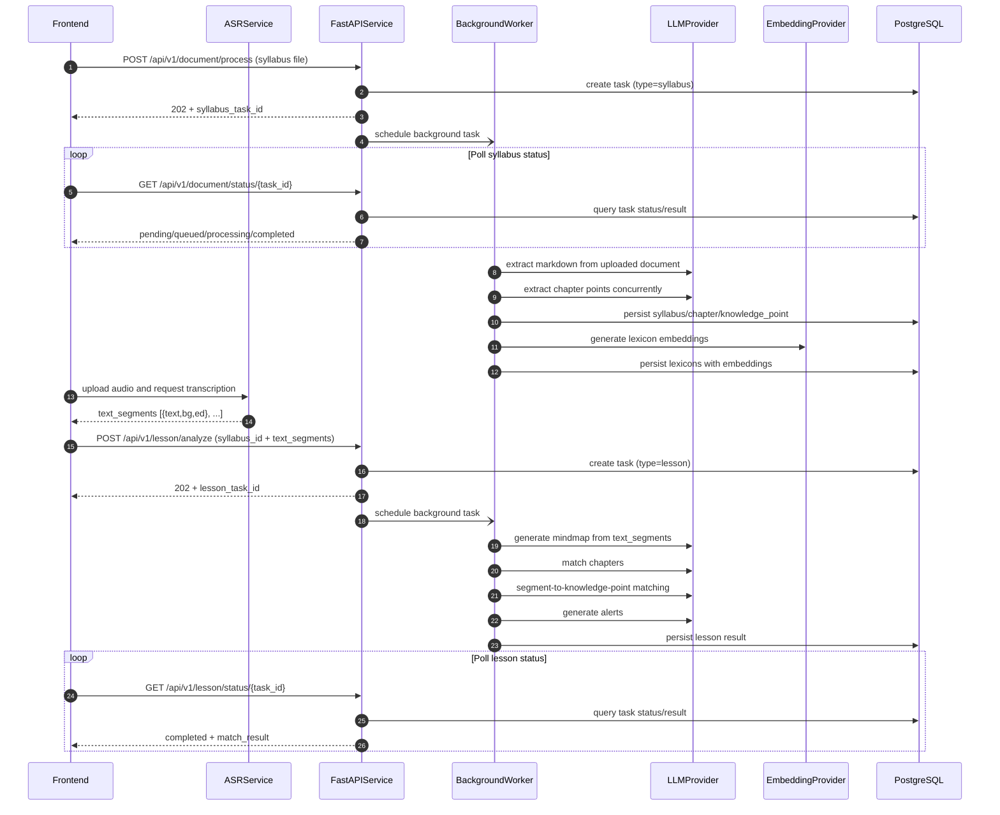

# 上传大纲到课堂匹配返回：当前时序图与瓶颈点

## 说明

- 本文描述的是**当前仓库已实现流程**，不包含改造方案。
- 当前服务**不做 ASR 识别**；音频由上游前端调用 ASR 服务转写后，再把 `text_segments` 传入本服务。

## 端到端时序图（当前实现）

## 瓶颈点（仅标注，不优化）

### P0：段落匹配阶段 Token 放大

- 现象：每个段落匹配时都把全量 `points_json` 放入 prompt，复杂度接近 `O(段落数 × 候选知识点数)`。
- 影响：LLM 请求体大、耗时高、费用高，课堂分析在段落数增大时明显变慢。
- 代码定位：
  - `app/services/lesson_pipeline.py:281-286`
  - `app/services/lesson_pipeline.py:330-334`

### P1：课堂分析链路 LLM 步骤较多且带重试

- 现象：课堂分析包含脑图生成、章节匹配、段落匹配、预警生成多个 LLM 阶段；脑图阶段存在多轮重试。
- 影响：端到端尾延迟高，任一前置步骤波动都会放大整体耗时。
- 代码定位：
  - `app/services/lesson_pipeline.py:541-583`
  - `app/services/mindmap_generator.py:216-253`

### P2：大纲入库阶段存在高频外部调用与事务往返

- 现象：保存大纲时按章节/知识点循环写库并频繁 `flush`，词库 embedding 在循环中逐批调用外部服务。
- 影响：文档较大时入库阶段耗时上升，数据库与 embedding 服务往返次数多。
- 代码定位：
  - `app/services/db/syllabus_service.py:104-110`
  - `app/services/db/syllabus_service.py:122-129`
  - `app/services/db/syllabus_service.py:135-149`
  - `app/services/embedding_service.py:54-64`

## 关联接口（便于联调）

- 大纲提取提交：`POST /api/v1/document/process`
- 大纲提取状态：`GET /api/v1/document/status/{task_id}`
- 课堂分析提交：`POST /api/v1/lesson/analyze`
- 课堂分析状态：`GET /api/v1/lesson/status/{task_id}`

